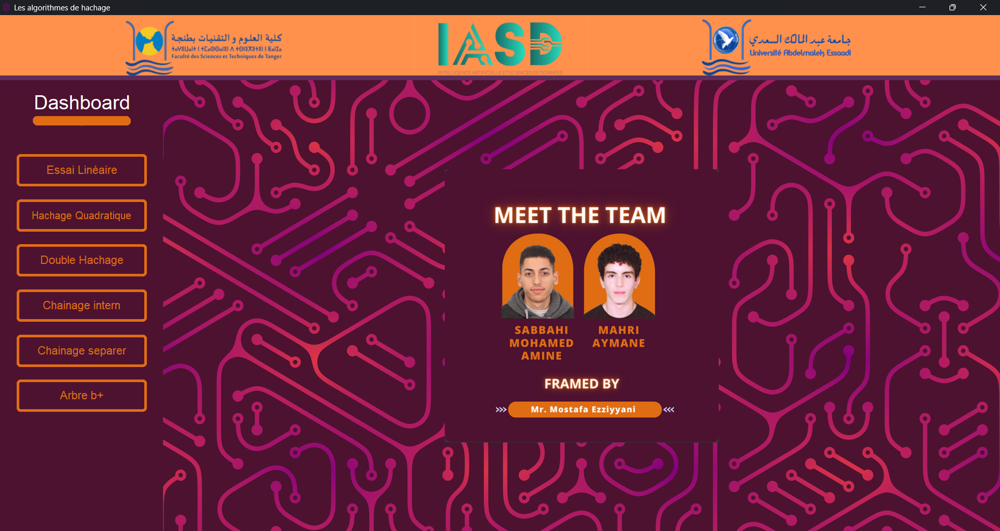
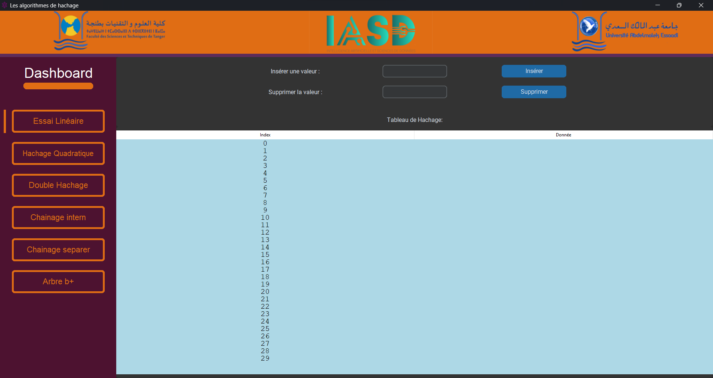
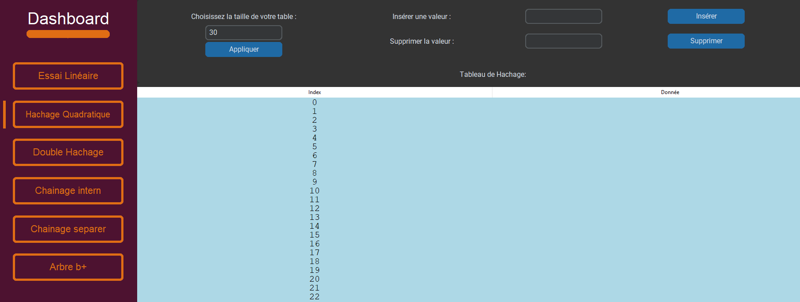
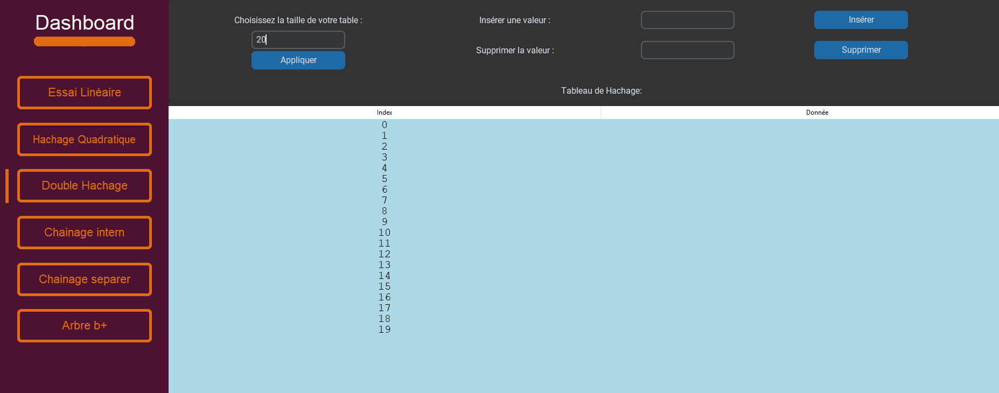
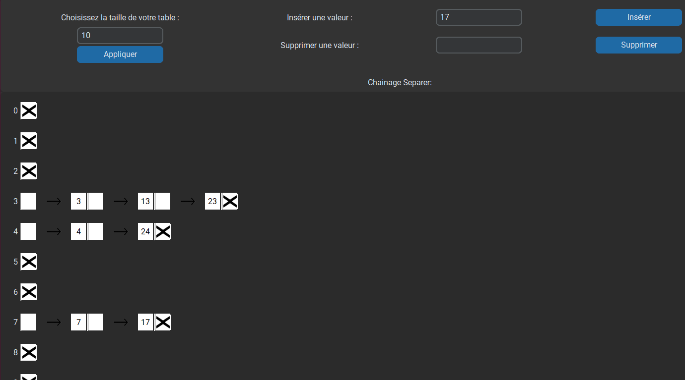
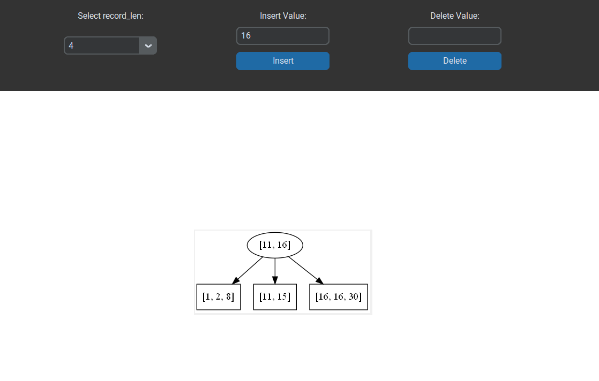

# Hashing and Indexing Algorithms Project

This project involves the implementation of various hashing and indexing algorithms within a graphical user interface (GUI) using Customtkinter in Python. This project is part of the Master AI and Data Science curriculum at Université Abdelmalek Essaadi.

## Table of Contents
- [Introduction](#introduction)
- [Requirements and Objectives](#requirements-and-objectives)
- [Proposed Interface](#proposed-interface)
- [Hashing Techniques](#hashing-techniques)
  - [Linear Probing](#linear-probing)
  - [Quadratic Probing](#quadratic-probing)
  - [Double Hashing](#double-hashing)
  - [Internal Chaining](#internal-chaining)
  - [Separate Chaining](#separate-chaining)
  - [B+ Tree](#b-tree)
- [Technologies and Development Tools](#technologies-and-development-tools)
- [Conclusion](#conclusion)
- [Bibliography](#bibliography)

## Introduction
This project aims to implement various hashing and indexing algorithms within a graphical user interface using the Customtkinter library and the Python programming language. These data structures and algorithms are essential in efficient data management and form the backbone of many modern computing applications.

## Requirements and Objectives
The main objectives of this project are:
- Implement functional hashing algorithms including linear probing, quadratic probing, double hashing, internal chaining, separate chaining, and B+ trees.
- Develop an intuitive and user-friendly interface to interact with these algorithms.
- Ensure effective collision management in each hashing algorithm.
- Optimize the algorithms for performance and resource efficiency.
- Design the application architecture for easy extensibility for future enhancements.

## Proposed Interface
The application interface is designed to be a central dashboard that provides an overview of the application. The interface includes buttons for quick access to different sections of the application, allowing users to explore the functionalities of various hashing algorithms easily. Each algorithm has a dedicated interface for its implementation and functionality.

## Hashing Techniques
### Linear Probing
Linear probing is a collision resolution technique that searches linearly in the hash table to find the next available slot.

#### Linear Probing Example

### Quadratic Probing
Quadratic probing uses a quadratic function to determine the next slots to check for inserting or finding an element, reducing clustering compared to linear probing.

#### Quadratic Probing Example

### Double Hashing
Double hashing employs a second hash function to calculate additional probe sequences, providing a better distribution and reducing clustering.

#### Double Hashing Example

### Internal Chaining
Internal chaining involves using links between records to navigate through data efficiently, using primary and foreign keys to establish relationships.

#### Internal Chaining Example

### Separate Chaining
Separate chaining stores elements with the same hash value in linked lists, efficiently managing collisions by storing elements in separate lists.

#### Separate Chaining Example

### B+ Tree
B+ trees are balanced tree structures used primarily in database systems for efficient data organization and storage.

#### B+ Tree Example

## Technologies and Development Tools
- **Python**: A high-level programming language known for its readability and versatility.
- **Customtkinter**: An extension of the Tkinter library in Python, providing enhanced GUI capabilities.
- **Visual Studio Code**: A source code editor supporting various programming languages.
- **Git**: A distributed version control system.
- **GitHub**: A platform for hosting and collaborating on Git repositories.

## Conclusion
The development of this hashing application has been an exciting and rewarding endeavor, providing an in-depth exploration of various hashing algorithms and techniques for data organization. This project not only demonstrates our understanding of fundamental concepts but also serves as a valuable resource for the data security and computer science community.

## Bibliography
1. [Hashing Linear Probing - Baeldung](https://www.baeldung.com/cs/hashing-linear-probing)
2. [Open Addressing Collision Handling - GeeksforGeeks](https://www.geeksforgeeks.org/open-addressing-collision-handling-technique-in-hashing)
3. [Closed Hash Visualization - USFCA](https://www.cs.usfca.edu/~galles/visualization/ClosedHash.html)
4. [B+ Tree Data Structures - Programiz](https://www.programiz.com/dsa/b-plus-tree)
5. [Customtkinter Documentation](https://customtkinter.tomschimansky.com/documentation/)

## Contributeurs

   - [SABBAHI MOHAMED AMINE (Me)](https://github.com/amine-sabbahi).

   - [MAHRI AYMANE](https://github.com/AymaneM21).

---

**Abdelmalek Essaadi University** Faculty of Sciences and Techniques
   - Department : Computer Engineering
   - Master : AI & DS
   - Module : Advanced Databases
   - Framed by : Pr. Ezziyyani Mostafa